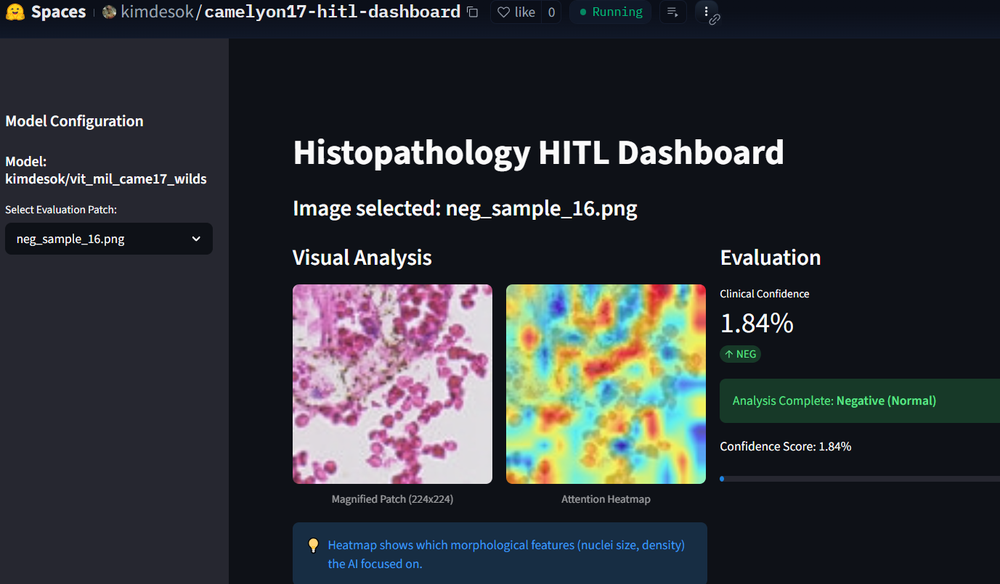

# Inference Service Platform for Cancer Diagnosis(Prototype)

## Project Overview

This page describes on-going experiments and implementation of components to build a prototype inference service platform for cancer diagnosis based on microscopic tissue images.   Currently the following tasks were planned and some of them were implemented:
* a RESTful client–server inference architecture
* benchmarking of the inference performance of deep learning models across GPUs and NPUs
* validation of the feasibility of a NPU-based production deployment
* Rough idea of `a pre-production research platform` to explore the architecture and operational workflow of a real clinical AI inference service.

🎯 **Specific Aims:**

1. Design and implement a REST API–based client–server web application as a production-oriented inference platform prototype
2. Benchmark GPU vs. NPU inference performance of CNN-MIL and ViT-MIL models
3. Support batch model compilation and deployment
4. Validate pathology AI service workflow (future work)

### System Architecture  
Client (Web / Streamlit)  

           │ 

           │    REST API   

           ▼
 

 Inference Server (FastAPI)

 ├── Model Loader 
 ├── Batch Compiler 
 ├── Runtime Selector (GPU / NPU) 
 └── Performance Profiler 

### Key Features

* Client–server inference execution mode comparison 
* One click batch compilation of GPU models for NPU deployment
* Hardware-aware runtime selection
* Integrated performance measurement

### Hardware Environment
* GPUs - NVIDIA T4, NVIDIA A100, NVIDIA H100
(additional GPUs depending on environment)

* NPU - Rebellions ATOM PLUS

## Results
### MIL Model Development for WSI-Based Diagnosis

**Hugging Face Space app** available: 

* Migration from Tensorflow/Keras Framework to `Pytorch ecosystem` that will enable the NPU compatible compilation of vsion foundation models provided by Hugging Face
* Preprocessed datasets need to be further processed or converted to Pytorch equivalents
(ex. from TFRecord to `IterableDataset` by tfrecord-dataset or `WebDataset/LMDB` to store and stream large-scale datasets)
* Internal A100 GPU support was discontinued and some model training was performed to Elice Group-provided A100 compute resources.
* The new environment enabled:
>- large-scale dataset acquisition
>- preprocessing
>- transformer-based MIL model development

### Dataset Acquisition & Processing
All training datasets were converted into TFRecord format for high-throughput training.
Secured Datasets
*TCGA-BRCA (breast cancer histopathology)

PatchCamelyon (lymph node metastasis classification)

*CAMELYON16 (WSI metastasis detection)

*Planned - CAMELYON17 (scheduled for acquisition in the second half of the year) 

### Storage Constraint
*Current storage: 2 TB
Limitations: Cannot store more than two datasets simultaneously
Each dataset requires: ~5 days for download and preprocessing

➡️ Required for full pipeline operation: ≥ 5 TB storage

This is a critical requirement for:
*multi-dataset training
*cross-domain generalization experiments

### Model Development
1️⃣ ViT-Based MIL (ViT-MIL)
Vision Transformer backbone
Designed for WSI bag-level classification

2️⃣ CNN-Based MIL
For performance comparison: ResNet50, VGG19, Inception V3

All CNN backbones were successfully trained in MIL configuration.

🧪 Training Status
Dataset	Status
TCGA-BRCA	- MIL training completed
CAMELYON16	-Dataset analysis in progress
PatchCamelyon	- Scheduled for MIL training
CAMELYON17	- Planned acquisition
📊 Performance (TCGA-BRCA Test Set)
Model Type	AUC
CNN	— (OOM – 160GB memory limit)
CNN-MIL	≥ 0.90
ViT-MIL	≥ 0.95

CNN tile-based training failed due to GPU memory limitations (OOM at 160 GB),
while MIL-based approaches enabled scalable WSI learning.

🔍 Key Technical Insight
*MIL is not just a modeling choice — it is a scalability enabler
*ViT-MIL shows clear performance advantage for WSI classification
*Storage capacity is a core infrastructure requirement, not an operational detail
 
Table 1. Performance comparison between CNN-MIL vs. ViT-MIL  
CNN을 backbone으로 한 MIL 모델과 ViT를 backbone으로 한 ViT-MIL과의 정확도 비교 

 
Figure 1.  Visualization of pixel level regional annotations as a part of EDA experiment (Micromestasis marking in green)  
EDA 실험의 일부로서 픽셀 수준의 어노테이션 정보(녹색실선)의 영역(region)별 가시화 

 
Figure 2 Visualization of pixel level cell type annotations as a part of EDA experiment (Marking of metastatic cancer in orange, tissue in green, and glass black ground in red) Each square represents a 224x224 patch image   EDA 실험의 일부로서 전체슬라이드영상에서 조직 영역(녹색 실선)과 유리 슬라이드 백그라운드 영역(적색 실선)으로 분할하고 전이암 조직 어노테이션 정보(오렌지색 실선)를 가시화. 사각형 타일은 224x224 패치영상을 나타냄. 

 
Figure 3 The slide on the left(A) shows the cancer tissue made of about 1,000 patch images, whereas the slide on the right(B) shows a couple of patch images representing tiny micrometastasis. EDA experiment hints that classifying the slide B could be somewhat difficult not to mention training a ViT-MIL in a straightforward manner.  Thus, as an alternative to WSI classification models, ones based on classification of patch level images or semantic segmentation could be tried.   좌측 슬라이드(A)에서는 암조직 영역이 약 1천여개의 패치 영상으로 이루어져 있지만, 우측 슬라이드(B)에서는 그 영역이 단지 2개의 패치 영상으로 이루어져 있음. EDA 실험의 일부로서 현재 학습 중인 ViT-MIL 모델 학습의 어려운 점과 추론 모델을 활용해서 B 슬라이드 영상을 암으로 분류하기는 매우 어려울 것이라고 예상할 수 있음.  그러므로, 전체슬라이드영상 분류 모델의 차선책으로 패치영상 분류 모델, Semantic Segmentation 모델 등 학습 실험이 수행되어야 함. 

 
Figure 4 EDA 실험의 일부로서 일정 크기(224x224)의 패치영상을 가시화. 전이암조직 영상이 캡쳐된 패치(적색 하일라이트)와 정상 림프조직 세포 패치영상의 형태학적 비교를 통해 패치수준의 영상분류 모델 학습이 가능하리라는 잠정적 결론의 근거 제공. 

 
Figure 5 클라이언트 앱 기능 시연: GPU(.keras 포맷)로 학습된 모델을 NPU(.rbln) 포맷으로 배치 컴파일하는 기능 시연 

 
Figure 6 클라이언트 앱 기능 시연: 실험 모델의 영상분류 성능을 정확도와 산출속도(Throughput)로 표시하고 각 실험 결과는 로깅함(Run history패널) 

